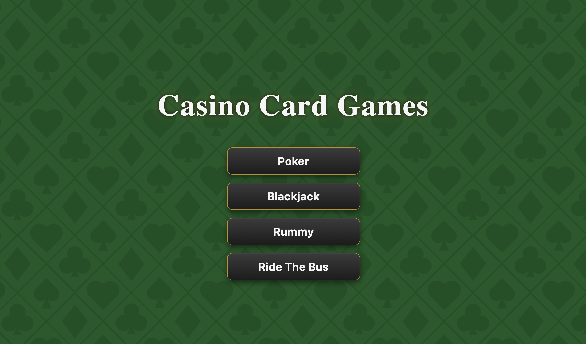
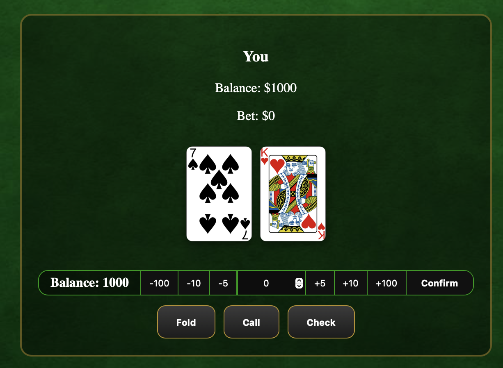
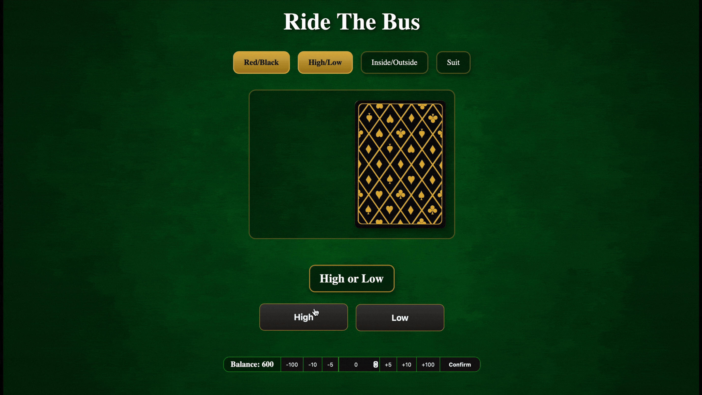

# Casino Card Game Engine
A modular card game engine supporting up to 4 games through shared systems.
Originally designed for Texas Hold'em, later the project was refactored into a modular system so new games can be added easily.

## Overview
This project currently has 4 games:
1. Poker
  - AI opponent
  - Betting
  - Folding
  - Calling
  - Checks
  - All-in
  - Community Cards
  - Pot Management
  - Showdown
2. Ride the Bus
  - Betting
  - Rounds
    - Red or Black
    - High or Low
    - Inside or Outside
    - Guess Suit
  - Cash out
  - Round Progression
3. Rummy
  - Draw from deck
  - Pick up 1 or multiple from discard
  - Place Melds
  - Add cards to melds
  - Round scoring
  - Winning Score
  - AI opponent
4. Blackjack
  - Betting
  - Hit/Stand
  - Split
  - Dealer Casino Logic
  - Bust Detection
  - 21 Detection

## Features

### Modular Game Architecture
- Shared card, deck, player, and game systems
- Game-specific logic is separated into individual modules
- New games can be added as easily as adding the file to the engine folder and updating game context

---

### Reusable Betting System
- Shared betting engine across all applicable games
- UI designed to fit all games

---

### Shared Card System
- Single Deck implementation used across all games
- Consistent Card and Player models
- Eliminates duplication between game implementations
- Cards are PNG files

---

### Game State Management
- Player state
- Turns and rounds are managed
- Game-specific phases and rules

## AI
The Poker and Rummy AI use Monte Carlo simulation to make decisions based on the current state of the game. Both AI systems are separated due to the differences between the games.

How it works:

The Poker AI uses Monte Carlo simulation to estimate the likelihood of winning with the current hand against the remaining opponents.

### Poker AI — Monte Carlo Process
1. **Evaluate the Current Hand**
   - The AI examines its hole cards and the community cards that are currently available.
2. **Generate Possible Actions**
   - The AI determines the available actions based on the current betting state, such as fold, check, call, raise, or all-in.
3. **Simulate Future Cards**
   - Unknown community cards and opponent hands are randomly generated to create possible future game states.
4. **Simulate the Hand**
   - Each simulated hand is played through to the showdown using the generated cards.
5. **Evaluate the Outcome**
   - The AI determines whether the simulated hand wins, loses, or ties against the opponents.
6. **Repeat the Simulation**
   - The process is repeated many times for the possible situations to produce a larger sample of outcomes.
7. **Estimate the Result**
   - The simulation results are used to estimate the AI's expected chance of winning and the potential value of continuing in the hand.
8. **Make a Decision**
   - The AI uses the estimated outcome along with factors such as the pot and current bet to select an action.
       
### Rummy AI — Monte Carlo Process
The Rummy AI uses Monte Carlo simulation to evaluate possible ways of improving its hand while reducing the value of cards that remain unplayed.
1. **Evaluate the Current Hand**
   - The AI examines its cards, existing melds, possible sets, and possible runs.
2. **Evaluate the Available Draws**
   - The AI considers the cards available from the deck and discard pile and determines which option could provide the most useful cards.
3. **Generate Possible Plays**
   - The AI identifies possible melds, cards that can be added to existing melds, and potential discards.
4. **Simulate Future Draws**
   - Possible future cards are randomly generated to represent different ways the hand could develop.
5. **Evaluate the Hand**
   - Each simulated outcome is evaluated based on useful melds created and the point value of cards remaining in the AI's hand.
6. **Repeat the Simulation**
   - Multiple simulations are performed to estimate how successful each possible decision is likely to be.
7. **Compare Possible Decisions**
   - The AI compares the expected results of different draws, melds, and discards.
8. **Make a Decision**
   - The AI selects the action that provides the most favorable expected outcome, prioritizing useful melds while reducing the value of its remaining hand.

---

## Gameplay







---

## Download and Play the Prebuilt Mac App

Download Here:

---

## Run from source
```bash
git clone https://github.com/JosephGarcia98/Card-Game
cd Card-Game
npm install
npm run dev