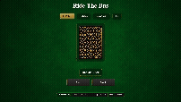

# Casino Card Game Engine
A modular card game engine supporting up to 4 games through shared systems.     
Orginally deisgned for Texas holdem, later the project was refactored into a modular system so new games can be added easily

## Overview

This project currently has 4 games:

- Poker
  - AI opponent 
  - Betting
  - Folding
  - Calling
  - Checks
  - All-in
  - Community Cards
  - Pot Management 
  - Showdown
- Ride the Bus
  - Betting
  - Rounds
    - Red or Black
    - High or Low
    - Inside or Outside
    - Guess Suit
  - Cash out
  - Round Progression
- Rummy
  - Draw from deck
  - Pick up 1 or multiple fomr discard
  - Place Melds
  - Add cards to melds
  - Round scoring 
  - Winning Score
  - AI opponent
- Blackjack
  - Betting 
  - Hit/Stand
  - Split
  - Dealer Casino Logic
  - Bust Detection
  - 21 Detection

## Features

### Modular Game Architecture
- Shared card, deck player and game system
- Game specific logic is seperated into individual modules
- New gmae can be added as easy as adding the file to the engine folder and updating game context

---

### Reusable Betting System
- Shared betting engine across all applicable games
- UI designed too fit all games

---

### Shared Card System
- Single Deck implementation used across all games
- Consistent Card and Player models
- Eliminates duplication between game implementations
- Cards are PNGs

---

### Game State Management 
- Player state
- Turns are round managed 
- Game specific phases and rules 


## AI
Stuff

---

## Gameplay





---

## Download and Play the Prebuilt Mac App
Download Here:

---

## Run from source
```bash
git clone https://github.com/JosephGarcia98/Card-Game
cd Card-Game
npm install
npm run dev